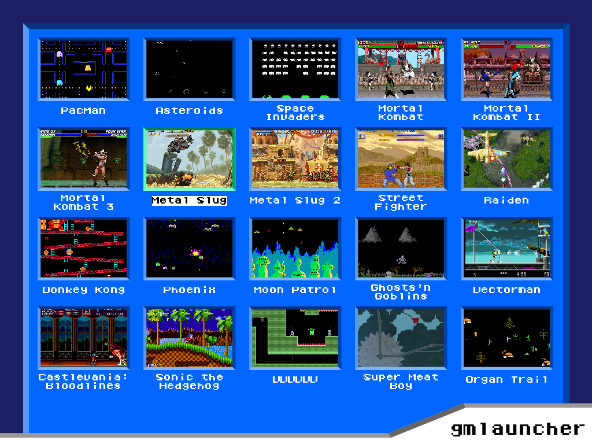

# gmlauncher #

gmlauncher is an Open Source game launcher written in C++ for custom-built Arcade cabinets, available under the GPLv3 license.

What it essentially does is to read a structure of menus and their menu entries from an XML-file and display it.
When a menu entry is triggered, it can do several kinds of things,
e.g. switch to another menu or execute a specified command (to launch a game, for example).
It uses SDL2 for rendering and LibXml2 for loading the menu structure.

This is what it can look like with the default theme:


## Building

Before compiling, you will have to install the libraries SDL2, SDL2_image
(with support for png and jpeg), SDL2_ttf and LibXml2, cmake and g++.
Then, you should be able to compile gmlauncher by calling the following commands in the source root:

* mkdir build
* cd build
* cmake ..
* make

If everything worked, you will now have an executable called `gmlauncher`.

## Running

To test it, go back to the source directory (important, as the test theme images are also located there) and create a very basic menu structure file:

```xml
<?xml version="1.0" encoding="UTF-8"?>
<gmlauncher-menu-structure main-menu="main">
    <menu name="main" type="list">
        <entry text="Quit" action="quit" />
    </menu>
</gmlauncher-menu-structure>
```

Save this as `menu_structure.xml` and run the executable from the same directory:

* build/gmlauncher

If everything went well, you should see a menu with one entry to quit the program.

## Configuration

As you may have noticed, by default, gmlauncher is not very flexible regarding the locations and names of the files it loads. 
These settings have to be adjusted directly inside the code.

The most important file for you will probably be [include/settings.h](include/settings.h), which contains settings in the form of defines.
By default, it looks like this:

```c++
#ifndef _SETTINGS_H
#define _SETTINGS_H

// set to true or false
#define FULLSCREEN_ENABLED      false

// resolution
#define SCREEN_WIDTH            1024
#define SCREEN_HEIGHT           768

// defines the xml-file from where the menu structure will be loaded
#define MENU_STRUCTURE_FILE     "menu_structure.xml"

// defines where the fonts and images of the theme are
#define THEME_FOLDER            "themes/test"

// defines from where the thumbnails will be loaded
#define THUMBNAILS_FOLDER       "thumbnails"

// Key bindings
#define INPUT_KEY_UP            SDL_SCANCODE_UP
#define INPUT_KEY_DOWN          SDL_SCANCODE_DOWN
#define INPUT_KEY_LEFT          SDL_SCANCODE_LEFT
#define INPUT_KEY_RIGHT         SDL_SCANCODE_RIGHT
#define INPUT_KEY_FIRE          SDL_SCANCODE_SPACE
#define INPUT_KEY_BACK          SDL_SCANCODE_ESCAPE
#define INPUT_KEY_QUIT          SDL_SCANCODE_F1

#endif
```

The meanings defines are either self explaining or described in the comment above. For defining Keyboard Buttons, use the SDL_Scancodes. Here's a list of all possible values: https://wiki.libsdl.org/SDL_Scancode.

I recommend to move the files to some global directory like /usr/share/gmlauncher. and set the defines to the absolute paths. This way, you can launch gmlauncher from anywhere on your filesystem after you installed it later.

When changing the resolution, keep in mind that the default theme is optimized only for 1024x768.
If you want to use any other resolution, you will have to use another backgound image with the desired resolution and also make some changes in [src/theme.cpp](src/theme.cpp) in order to make it look decent. Take a look at `CTheme:Load(void)`.
Pretty much all the the positions, distances, etc. are set there.

After changing the code, of course, you will have to recompile it by calling `make` inside the build directory.

## Installing gmlauncher

When you are satisfied with your configuration, you can install gmlauncher, if you want, by running this in the build directory:

* sudo make install

If you want to manually set the install prefix for cmake, re-run cmake before like this, for example (you could have also done this instead of the simple "cmake .." before):

* cmake -DCMAKE_INSTALL_PREFIX:PATH=/usr ..

If you want to install gmlaucher, I recommend to move all the files, inluding the theme, to a global directory, as only the executable is copied by the install.

## Advanced Menu Structures

This is an example that uses all possible features for defining menu structures:

```xml
<?xml version="1.0" encoding="UTF-8"?>
<gmlauncher-menu-structure main-menu="main">
    <menu name="main" type="list">
        <entry text="Start Game" action="menu" menu="games" />
        <entry text="Quit" action="quit" />
        <entry text="Run something and quit" action="quit"
            command="executed_before_quiting" />
    </menu>
    <menu name="games" type="thumbs">
        <entry text="E.T. the Extra-Terrestrial" action="command"
            command="some_command_that_starts_the_game"
            thumbnail="et.png" />
    </menu>
</gmlauncher-menu-structure>
```


## My Arcade setup

I developed gmlauncher for an Arcade cabinet I've built with a friend in 2012. 
I used an old desktop PC from 2003 or so on which I installed Debian wheezy,
which runs pretty fast considering the old hardware! 
When Debian boots, slim (the login manager) automatically logs
in the player user and starts a very simple configured fvwm2 session 
which then, also automatically, starts gmlauncher.

The launcher can then be controlled by one of the built-in joysticks and a button,
so no mouse or keyboard is necessary to start a game.

## About
Created by Florian Märkl: https://www.metallic-entertainment.com

This program is free software: you can redistribute it and/or modify
it under the terms of the GNU Lesser General Public License as published by
the Free Software Foundation, either version 3 of the License, or
(at your option) any later version.

This program is distributed in the hope that it will be useful,
but WITHOUT ANY WARRANTY; without even the implied warranty of
MERCHANTABILITY or FITNESS FOR A PARTICULAR PURPOSE.  See the
GNU Lesser General Public License for more details.

You should have received a copy of the GNU Lesser General Public License
along with this program.  If not, see <http://www.gnu.org/licenses/>.